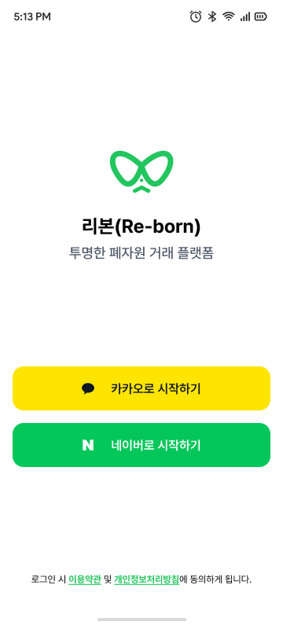
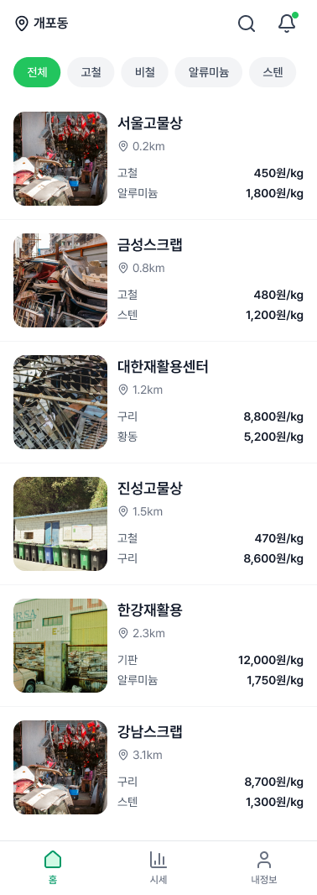
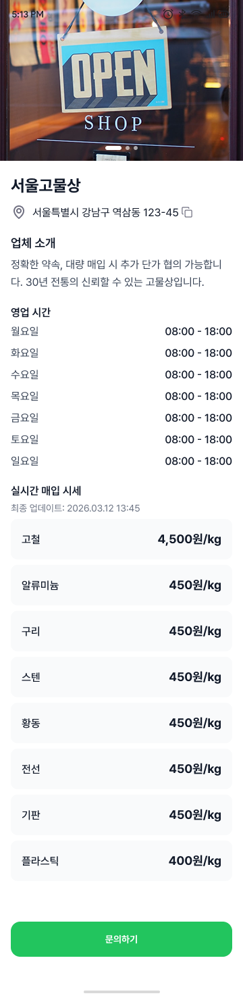
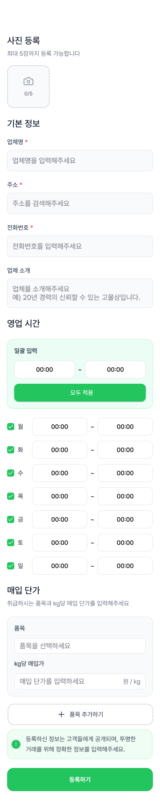
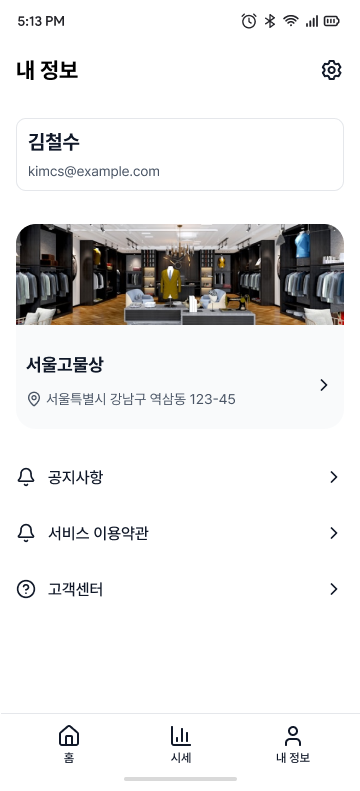
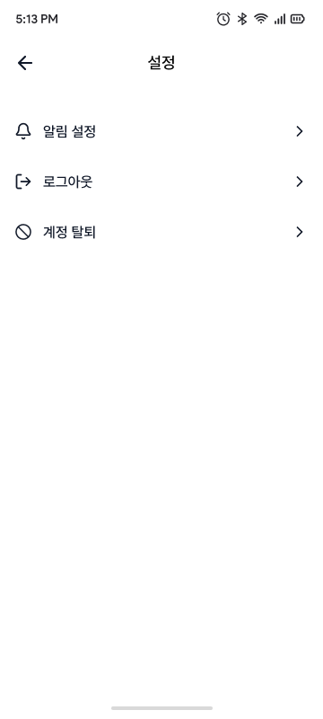
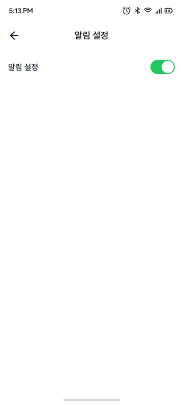

# 1. 프로젝트 개요

- **서비스명(가칭):** 리본**(Re-born)** - "투명한 단가 공개로 고물 거래의 기준을 세우다"
- **핵심 가치:** 폐기물 배출 (공장, 일반인 등)와 수거 업체(고물상) 간의 **정보 불균형 해소** 및 **거래 최적화**.
- **타겟 고객**
  - **공급자**
    - 폐자원이 다량 발생하는 소규모 공장, 사업장.
    - 일반 가정에서 배출되는 폐자원
  - **수요자**
    - 원자재 확보가 필요한 고물상

---

## 2. 스크린샷

| 로그인 | 홈 (고물상 목록) | 업체 상세 |
|:---:|:---:|:---:|
|  |  |  |
| 카카오/네이버 소셜 로그인 | 주변 고물상 목록 및 카테고리 필터 | 업체 정보, 영업시간, 실시간 매입 시세 |

| 업체 등록 | 내 정보 | 설정 | 알림 설정 |
|:---:|:---:|:---:|:---:|
|  |  |  |  |
| 사진, 기본정보, 영업시간, 매입단가 등록 | 프로필 및 업체 정보 확인 | 알림, 로그아웃, 계정 탈퇴 | 알림 수신 on/off |